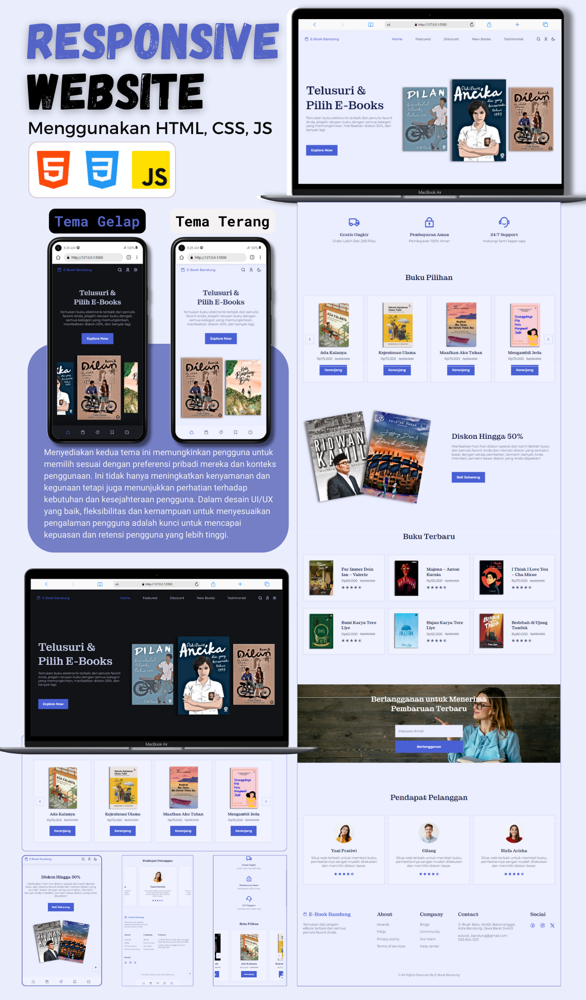

  
   

  <h1 align="center">Website - E-Book Bandung</h1>

  E-Book Bandung adalah situs web toko buku yang sepenuhnya responsif,  Responsif untuk semua perangkat, dibuat menggunakan HTML, CSS, dan JavaScript.

  <a href="https://codewithsadee.github.io/foodie/"><strong>➥ Live Demo</strong></a>

 

### Demo Screeshots

### Responsive Book Website

- Desain Situs Web Buku Responsif Menggunakan HTML CSS & JavaScript
- Memiliki animasi saat menggulir halaman.
- Menggunakan pengguliran halus di setiap bagian.
- Terdapat modal pencarian dan login.
- Termasuk tema gelap & terang.
- Dikembangkan pertama dengan metodologi Mobile First, kemudian untuk desktop.
- Kompatibel dengan semua perangkat mobile dan dengan antarmuka pengguna yang indah dan menyenangkan.

untuk sumber kontent buku hanya sebagai contoh, yang didapatkan di situs gramedia.com